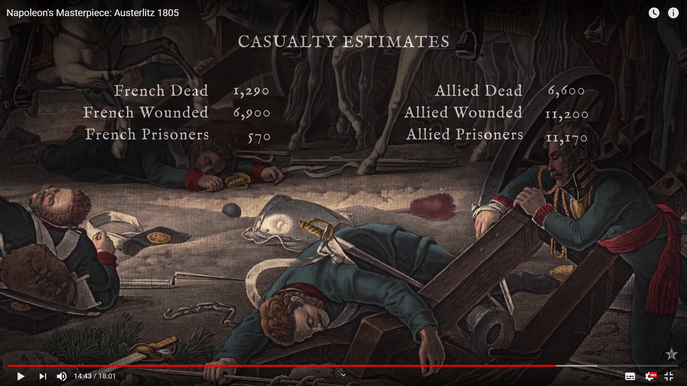
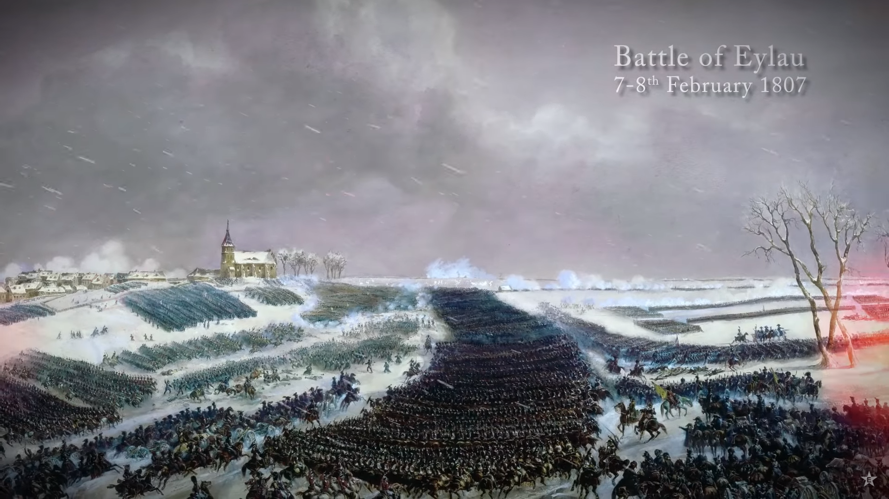

# Notizen
[https://de.wikipedia.org/wiki/Infanterie](https://de.wikipedia.org/wiki/Infanterie)  
Kompanie = 72 Musketiere, 54 Pikenträger (126)  
4 Kompanien = 1 Batallion (504)  
8 Battallione = 1 Regiment (4032)  
2-4 Regimenter = 1 Brigade (8064 - 16128)  

[https://de.wikipedia.org/wiki/Regiment#Geschichte](https://de.wikipedia.org/wiki/Regiment#Geschichte)
Die Inhaber eines Regiments waren Kriegsunternehmer, die im Auftrag der kriegführenden Fürsten auf eigene Rechnung Söldner warben, bewaffneten, ausrüsteten und bezahlten, um sie unter ihrem Kommando dann dem Auftraggeber gegen Geld zur Verfügung zu stellen. Der Regimentschef stellte in der Regel auch die Versorgung seines Regiments auf eigene Rechnung sicher, der Preis für Verpflegung und die (ab der zweiten Hälfte des 17. Jahrhunderts übliche) Uniformierung wurde dann den Soldaten vom Sold abgezogen. Durch Großeinkauf oder eigene Herstellung dieser Güter konnte der Regimentschef erhebliche Preisvorteile erreichen und somit beträchtliche Gewinne erzielen. Prototyp eines solchen Unternehmers war Wallenstein, der böhmische Feldherr und kaiserliche Generalissimus im Dreißigjährigen Krieg, der für den Kaiser sogar ein Heer von 20.000 Mann nach diesem Muster organisierte.

Beispiel Verluste

Massenschlacht
